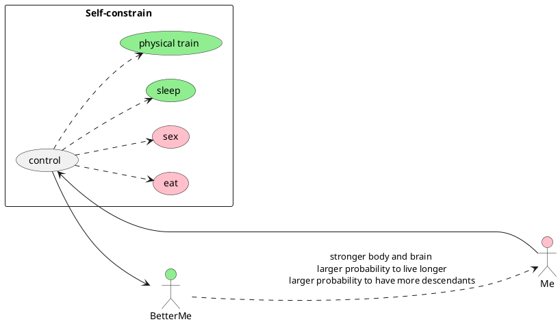
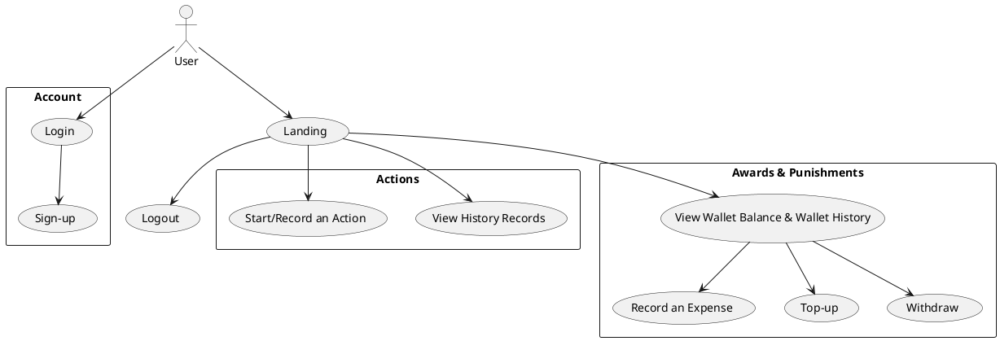
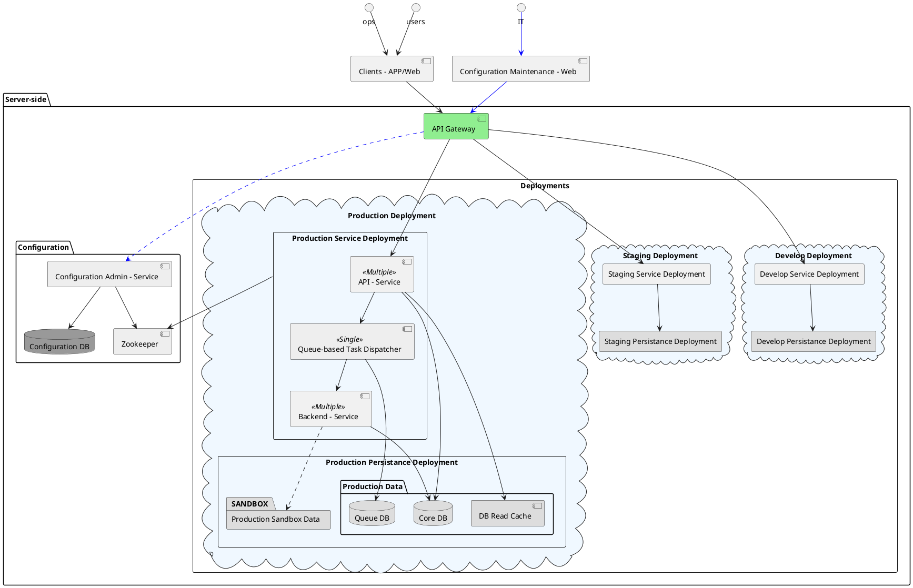
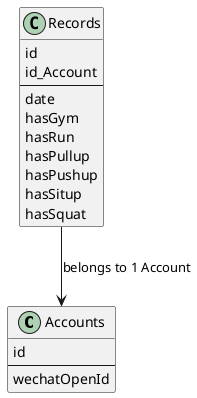

Gym Document

```
npm i -g docsify
npm i -g live-server

live-server .
```

# Product Design

### Design Principles


```plantuml
@startuml
left to right direction
skinparam packageStyle rectangle 
actor Me #pink
actor BetterMe #lightgreen

rectangle "Self-constrain" {
	(control)
	(eat) #pink
	(sex) #pink
	(sleep) #lightgreen
	(physical train) #lightgreen

	Me --> (control)
	(control) ..> (eat)
	(control) ..> (sex)

	(control) ..> (sleep)
	(control) ..> (physical train)

	(control) --> BetterMe
}

BetterMe ....> Me : stronger body and brain\n larger probability to live longer\n larger probability to have more descendants
@enduml
```

### Use Cases

```plantuml
@startuml
:User: as USER

rectangle "Account" {
	(Sign-up)
	(Login)
	(Login) --> (Sign-up)
}

(Landing)
(Logout)

rectangle "Actions" {
	(View History Records) as (HISTORY)
	(Start/Record an Action) as (START)
}

rectangle "Awards & Punishments" {
	(View Wallet Balance & Wallet History) as (WALLET)
	(Record an Expense) as (EXPENSE)
	(Top-up) as (TOPUP)
	(Withdraw)
	(WALLET) --> (EXPENSE)
	(WALLET) --> (TOPUP)
	(WALLET) --> (Withdraw)
}

USER --> (Login)

USER --> (Landing)
(Landing) --> (Logout)
(Landing) --> (HISTORY)
(Landing) --> (START)

(Landing) --> (WALLET)
@enduml
```

### Page Flow

# Component Diagram

```plantuml
@startuml

interface IT
interface ops
interface users

component [Clients - APP/Web] as APP
component [Configuration Maintenance - Web] as WEB

ops --> APP
users --> APP
IT --> WEB #blue

package "Server-side" {

	component [API Gateway] as API_GATEWAY #lightgreen

	package "Configuration" {
		component [Configuration Admin - Service] as CONF #eee
		database "Configuration DB" as CONF_DB #999
		component [Zookeeper] as ZK #eee

		CONF --> CONF_DB
		CONF --> ZK
	}

	API_GATEWAY ..> CONF #blue

	rectangle "Deployments" {
		cloud "Production Deployment" as PROD  #aliceblue {
		
			rectangle "Production Service Deployment" as PROD_SERVICE {
				component [API - Service] as API << Multiple >>
				component [Queue-based Task Dispatcher] as Q << Single >> #eee
				component [Backend - Service] as BE << Multiple >>
				API --> Q
				Q --> BE
			}

			rectangle "Production Persistance Deployment" {
				package "Production Data" as PROD_DATA {
					component [DB Read Cache] as CACHE #ddd
					database "Core DB" as DB #ddd
					database "Queue DB" as QDB #ddd
				}
				package "Production Sandbox Data" as SANDBOX #ddd {
				}
			}

			API --> CACHE
			BE --> DB
			API --> DB
			Q -> QDB

			BE .> SANDBOX

			PROD_SERVICE --> ZK

		}

		cloud "Staging Deployment" as STAGING #aliceblue {
			rectangle "Staging Service Deployment" as STAGING_SERVICE {
			}

			rectangle "Staging Persistance Deployment" as STAGING_DATA #ddd {
			}
			STAGING_SERVICE --> STAGING_DATA
		}

		cloud "Develop Deployment" as DEV  #aliceblue {
			rectangle "Develop Service Deployment" as DEV_SERVICE {
			}

			rectangle "Develop Persistance Deployment" as DEV_DATA #ddd {
			}
			DEV_SERVICE --> DEV_DATA
		}

	}

	API_GATEWAY --> API
	API_GATEWAY ---> STAGING_SERVICE
	API_GATEWAY ---> DEV_SERVICE

}

APP --> API_GATEWAY
WEB --> API_GATEWAY #blue

@enduml
```

# DB Schema

```plantuml
@startuml
class Accounts {
	id
	--
	wechatOpenId
}

class Records {
	id
	id_Account
	--
	date
	hasGym
	hasRun
	hasPullup
	hasPushup
	hasSitup
	hasSquat
}

Records --> Accounts : belongs to 1 Account
@enduml
```
